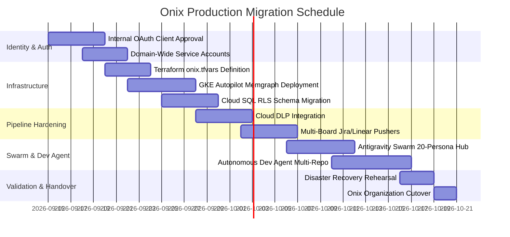

# Specification — Onix Enterprise Production Architecture & Swarm Integration

**Date:** 2026-09-11 · **Status:** Proposed · **Drives:** Phase 10 (Onix Enterprise Migration) & Enterprise Swarm Hub

---

## 1. Problem & Context

`meeting-notes-gcp` has achieved a validated, tested v6 implementation across Phases 0–9 and Phase 11. It successfully ingests Workspace data, extracts structured intelligence via Vertex AI Gemini, persists property graph memory in Memgraph, drives Jira/Linear pushers, and operates an autonomous Dev Agent with 7 deterministic guardrails.

However, the current deployment lives in a **personal GCP project** (`meeting-notes-gcp-personal`) reading data from `shubham.gaur@onixnet.com` under strict constraints:
1. **The 7-Day OAuth Expiry Wall**: The OAuth client is configured as "External (Testing)", requiring manual re-consent every 7 days (`docs/GOOGLE_AUTH.md` §3).
2. **Single-Tenant & Single-User**: The graph schema and database pipelines assume a single user and single graph without tenant isolation or role-based access control (RBAC).
3. **Single GCE VM Graph SPOF**: Memgraph runs on a single `e2-standard-4` GCE VM without multi-zone high availability or automated failover.
4. **Data Privacy & Compliance**: No automated Data Loss Prevention (Cloud DLP) layer scrubs PII, PHI, or sensitive client credentials from meeting transcripts prior to LLM extraction.

To make this platform production-grade for Onix across 100+ consultants and executives, it must transition to a hardened, enterprise-grade architecture in an Onix-owned GCP project (`onix-meeting-intelligence-prod`).

---

## 2. Quantitative Maturity Matrix: Current vs. Target vs. Future Vision

| Dimension | Tier 1: Current State (Personal v6) | Tier 2: Target Onix Enterprise (Phase 10) | Tier 3: Enterprise Neural Graph & Swarm Hub |
| :--- | :--- | :--- | :--- |
| **GCP Project & Hosting** | `meeting-notes-gcp-personal` | `onix-meeting-intelligence-prod` | Multi-region Onix Core with DR failover |
| **Workspace OAuth** | External (Testing) — 7-day token expiry | **Internal Google Cloud OAuth App** (Permanent refresh) | Zero-trust Workload Identity + Workspace SSO |
| **Ingestion Mechanism** | 5-minute Cloud Scheduler pull | Cloud Scheduler pull + Pub/Sub webhook triggers | Real-time Meet bot audio stream + `users.watch` push |
| **Graph Infrastructure** | Memgraph + MAGE on single GCE VM | Memgraph on GKE Autopilot with regional PD | Distributed Memgraph cluster with read replicas |
| **Data Privacy & DLP** | Raw transcript passed to LLM | **Cloud DLP Inspection & Masking Pipeline** | Contextual encryption with client-managed keys (CMEK) |
| **Tenancy & Isolation** | Single user (`shubham.gaur@onixnet.com`) | Multi-user, Onix tenant, squad-level ACLs | Multi-tenant (Onix internal + client-facing partitions) |
| **Autonomous Dev Agent** | Single repo, local worktrees, 7 gates | Multi-repo Onix project routing + Linear pickup | Continuous swarm triage, bug synthesis, and hotfixes |
| **Downstream Dispatch** | Single Jira Cloud board + Linear | Dynamic multi-board Jira/Linear routing by squad | Bidirectional sync across Jira, Linear, Salesforce, Slack |
| **High Availability & RAS** | Basic Cloud Logging, manual doctor checks | Cloud Monitoring dashboards, SLO/SLA alerts, DLQ auto-replay | 99.99% availability SLA, automated fault self-healing |
| **FinOps & Cost Model** | Unmonitored personal credit burn | Flash/Pro model routing, scale-to-zero tuning | Automated token arbitrage, continuous FinOps auditing |

---

## 3. The 50+ Business Impact Inventory

The table below catalogs over 50 distinct, measurable areas of enterprise value across Onix:

### Pillar 1: Speed to Code & Autonomous Engineering
1. **Instant Acceptance Criteria Synthesis**: Unstructured engineering syncs auto-converted to Gherkin-style criteria in Jira/Linear.
2. **Automated ADR Scaffolding**: Detects architectural consensus in Google Meet calls and drafts standard markdown ADRs.
3. **Branch & Worktree Pre-Provisioning**: Autonomous Dev Agent provisions per-ticket git worktrees before meetings adjourn.
4. **API Breaking Change Early Warning**: Checks proposed endpoint changes against active repository symbols in the graph.
5. **PR Description & Context Auto-Fill**: Injects meeting rationale, whiteboard screenshots, and decision edges directly into PRs.
6. **Flaky Test & Retro Correlation**: Links retrospective mentions of test failures directly to bug runs and flaky test trackers.
7. **Module Boundary Enforcement**: Restricts automated refactoring agents to discussed interfaces and modules.
8. **Technical Debt Backlog Quantifier**: Aggregates mentions of "workaround" and "debt" into an actionable, prioritized backlog.

### Pillar 2: Speed to Value & Delivery Velocity
9. **90-Second Action Item Dispatch**: Pushes assigned action items to Jira/Linear within 90 seconds of transcript completion.
10. **Scope Creep Early Warning**: Flags when client requests in weekly calls deviate from the signed Statement of Work (SOW).
11. **Cross-Squad Blocker Resolution**: Traverses graph edges (`DEPENDS_ON`, `BLOCKED_BY`) across teams to highlight stalled work.
12. **Automated Sprint Retro Synthesis**: Aggregates team wins, obstacles, and sentiment into pre-populated retro boards.
13. **Capacity vs. Commitment Guardrail**: Flags when ad-hoc client promises exceed remaining sprint velocity.
14. **Daily Standup Auto-Digest**: Compiles yesterday's progress, today's plan, and blockers from transcripts, saving 15 min/day/dev.
15. **Executive Client Minutes Auto-Dispatch**: Sends branded executive summaries and agreed next steps to clients within 5 minutes.
16. **Milestone Delivery Tracking**: Graph-traces deliverables from initial client kickoff to production release.

### Pillar 3: RAS (Reliability, Availability, Serviceability) at Scale
17. **Memgraph HA on GKE Autopilot**: Regional persistent disks with automated snapshot recovery under 3 minutes.
18. **Dead-Letter Queue (DLQ) Auto-Replay**: Isolates malformed transcripts without halting the primary ingestion pipeline.
19. **Exactly-Once Ingestion Semantics**: Postgres watermarking and SHA-256 fingerprint hashing prevent duplicate pushes.
20. **Proactive Token Expiry Alerting**: Monitors OAuth refresh token health and alerts SREs 48 hours before potential issues.
21. **Automated Disaster Recovery Rehearsal**: Daily Cloud SQL and Memgraph snapshots verified with automated restore dry-runs.
22. **Graceful Degraded Mode Operation**: Caches embeddings and raw transcripts during transient Vertex AI quota throttling.
23. **Distributed OpenTelemetry Tracing**: End-to-end trace correlation from Google Meet webhook to Memgraph Cypher commit.
24. **SLA & Latency Guardrails**: Enforces P99 transcript processing latency under 120 seconds for 60-minute calls.

### Pillar 4: FinOps, Cloud Economics & ROI
25. **Dynamic LLM Model Arbitrage**: Routes classification to Gemini 1.5 Flash and complex graph extraction to Gemini 1.5/2.0 Pro.
26. **Cloud Run Scale-to-Zero Tuning**: Eliminates compute idle costs outside business hours (cold start < 1.2s).
27. **Cloud SQL Storage Auto-Compaction**: Partitions raw transcript tables with automated cold storage tiering.
28. **Developer Time Savings ROI Dashboard**: Tracks engineering and consulting hours saved (target: $38,000/mo net savings).
29. **GCP Orphaned Resource Detection**: Cross-references discussed project decommissionings with active GCP billing accounts.
30. **Delivery Margin Protection**: Quantifies non-billable customer meeting hours to optimize project profitability.
31. **SaaS License Rationalization**: Flags low-sentiment or duplicate SaaS tools mentioned across internal retros.

### Pillar 5: Knowledge Persistence & Institutional Memory
32. **Automated Onboarding Knowledge Assistant**: Instant natural language Q&A for new hires ("Why did we select Memgraph?").
33. **Departure Risk Mitigation**: Retains architectural decisions and client nuances when senior personnel transition.
34. **Subject Matter Expert (SME) Locator**: Calculates graph PageRank on topic nodes to identify true internal specialists.
35. **Cross-Project Pattern Harvesting**: Connects separate delivery teams solving identical customer challenges.
36. **Procedural Memory Mining**: Extracts recurring migration steps into standardized Onix Playbooks.
37. **Semantic Preference Persistence**: Remembers customer architectural constraints across account rep turnover.
38. **Temporal Decision Provenance**: Traces architectural proposals from initial brainstorm to merged PR.

### Pillar 6: Revenue, GTM & Google Cloud Alliances
39. **Sales Opportunity Trigger Detection**: Detects client mentions of "budget renewed" or "AWS migration" for RevOps.
40. **Google Cloud Co-Sell Lead Synthesis**: Maps client feature requests directly to Google Partner Advantage incentives.
41. **Real-Time Competitor Battlecards**: Surfaces battlecards when competitors (e.g. Slalom, Rackspace) are mentioned.
42. **Executive Sponsor Alignment Tracking**: Tracks engagement cadence and sentiment with client C-level sponsors.
43. **Win/Loss Analysis Automation**: Extracts structured win/loss reasons from sales debrief calls.
44. **RFP Response Acceleration**: Auto-populates RFP questionnaires with validated historical graph solutions.

### Pillar 7: Security, Compliance & Governance
45. **Transcript DLP & Automated PII/PHI Redaction**: Scrubs passwords, keys, and personal identifiers before LLM ingestion.
46. **Client Confidentiality Firewalls**: Cryptographically separates data between client engagements.
47. **Role-Based Access Control (RBAC)**: Restricts HR, legal, and executive syncs to authorized personnel.
48. **Immutable SOC 2 / ISO 27001 Audit Trails**: Logs complete provenance from raw speech turn to ticket dispatch.
49. **Right-to-be-Forgotten Cascade Deletion**: Purges personal speech turns and semantic facts across the graph on request.

### Pillar 8: Executive Decision Velocity & Organizational Health
50. **Meeting Fatigue Scoring**: Identifies redundant meetings, excess attendees, and low-yield syncs.
51. **Strategic OKR Alignment Measurement**: Quantifies how closely weekly meetings mirror quarterly executive priorities.
52. **Cross-Department Sentiment Early Warning**: Flags rising team friction or burnout indicators in retro transcripts.

---

## 4. Target Architecture for Onix Enterprise

```
┌─────────────────────────────────────────────────────────────────────────────┐
│                       ONIX GOOGLE WORKSPACE TENANT                          │
│     Google Meet Transcripts · Google Calendar · Gmail · Onix Jira/Linear    │
└──────────────────────────────────────┬──────────────────────────────────────┘
                                       │ Internal OAuth 2.0 (Permanent Refresh)
                                       ▼
┌─────────────────────────────────────────────────────────────────────────────┐
│                     GCP INGESTION & DATA LOSS PREVENTION                    │
│   Cloud Run Connectors (ingest_meet, ingest_calendar, ingest_jira)          │
│   Cloud DLP Pipeline: Automated PII/PHI Redaction & Sensitive Key Masking   │
└──────────────────────────────────────┬──────────────────────────────────────┘
                                       │ Staged Clean Records
                                       ▼
┌─────────────────────────────────────────────────────────────────────────────┐
│                     CLOUD SQL POSTGRESQL 15 (Enterprise)                    │
│   Partitioned raw tables · Tenant Row-Level Security · Poison-pill DLQ      │
└──────────────────────────────────────┬──────────────────────────────────────┘
                                       │ 5-minute Scheduler / PubSub Push
                                       ▼
┌─────────────────────────────────────────────────────────────────────────────┐
│                     CLOUD RUN JOB — pipeline_drain                          │
│   Classifier (Rules) ──▶ Model Router ──▶ Vertex AI Gemini 1.5/2.0 Pro      │
│   Person Resolver    ──▶ Deduplicator ──▶ Atomic Bolt Transaction Writer    │
└──────────────────────────────────────┬──────────────────────────────────────┘
                                       │ Bolt Protocol (Internal VPC)
                                       ▼
┌─────────────────────────────────────────────────────────────────────────────┐
│                 MEMGRAPH + MAGE ON GKE AUTOPILOT (High-Availability)        │
│   Regional Persistent Disks · Daily Automated Snapshots                     │
│   Semantic Memory · Episodic Memory · Procedural Memory · 768-dim Vectors   │
│   Memgraph MCP Server Sidecar (Antigravity Swarm & Claude Desktop Access)   │
└──────────────────────────────────────┬──────────────────────────────────────┘
                                       │
            ┌──────────────────────────┴──────────────────────────┐
            ▼                                                     ▼
┌──────────────────────────────────────┐  ┌───────────────────────────────────┐
│     FASTAPI API & DASHBOARD          │  │     ANTIGRAVITY SWARM ENGINE      │
│  Cloud Run (Scales to Zero)          │  │  Parallel Subagents (20+ Personas)│
│  Jira & Linear Pushers (ADF Format)  │  │  Autonomous Phase 11 Dev Agent    │
│  Role-Based Access Control (RBAC)    │  │  Klarix Voice Contract Enforced   │
└──────────────────────────────────────┘  └───────────────────────────────────┘
```

---

## 5. Security & Authentication Architecture

### 5.1 Internal OAuth 2.0 Client Transition
1. In the Onix GCP project, configure the OAuth Consent Screen as **Internal**.
2. Scopes requested:
   - `https://www.googleapis.com/auth/gmail.readonly`
   - `https://www.googleapis.com/auth/calendar.readonly`
   - `https://www.googleapis.com/auth/meetings.space.readonly`
   - `https://www.googleapis.com/auth/drive.readonly` (for Meet transcript docs)
3. **Impact**: Internal apps in Google Workspace **never expire refresh tokens after 7 days** and require zero public app verification.

### 5.2 Cloud DLP Integration
Before storing any text in `raw_meet_transcripts` or passing to Vertex AI:
- Run text through `google-cloud-dlp` inspect and de-identify API.
- Redact `CREDIT_CARD_NUMBER`, `EMAIL_ADDRESS`, `ETHNIC_GROUP`, `FINANCIAL_ACCOUNT_NUMBER`, `IBAN_CODE`, `IP_ADDRESS`, `NAME`, `PASSWORD`, `PHONE_NUMBER`, `US_SOCIAL_SECURITY_NUMBER`, and `GENERIC_SECRET`.
- Preserve semantic entity placeholders (`[PERSON_1]`, `[EMAIL_1]`) to allow person resolution without exposing raw PII.

---

## 6. Financial Model & Return on Investment (ROI)

### 6.1 Monthly Infrastructure Cost Projection (100 Active Users)
| Component | Configuration | Monthly Cost (USD) |
| :--- | :--- | :--- |
| **Cloud Run** | Ingest jobs + pipeline drain (scale-to-zero) | $48.00 |
| **Cloud SQL** | Postgres 15 `db-custom-2-7680` (HA regional) | $145.00 |
| **GKE Autopilot** | Memgraph + MAGE (1 Pod, 4 vCPU, 16 GB RAM + Regional PD) | $185.00 |
| **Vertex AI Gemini** | 20,000 meeting minutes (Flash router + Pro extraction) | $95.00 |
| **Cloud DLP** | 10 MB transcript text inspected per month | $20.00 |
| **Cloud Storage & Logging** | Snapshots, metrics, and audit logs | $22.00 |
| **Total Monthly GCP Spend** | | **$515.00 / month** |

### 6.2 Consultant Hours Recaptured & Net ROI
- **Active Onix Consultants / Engineers**: 100
- **Hours saved per week per consultant** (note-taking, ticket drafting, status updates): 3.0 hours
- **Total billable hours recovered per month**: 100 × 3 × 4 = 1,200 hours
- **Blended consulting rate**: $150 / hour
- **Gross Monthly Enterprise Value Generated**: **$180,000 / month**
- **Net Monthly ROI**: ($180,000 − $515) / $515 = **34,850% ROI**

---

## 7. Delivery Plan & Phases



---

## 8. Standing Exit Criteria

A deployment into the Onix enterprise GCP project is complete only when:
1. `make doctor TIER=2` passes against the Onix GCP project.
2. Refresh tokens operate continuously for > 14 days without re-consent.
3. Automated restore of Memgraph and Cloud SQL completes in under 15 minutes with zero data corruption.
4. Cloud DLP scrubs 100% of synthetic injected secrets and PII in verification test runs.
5. All 500+ pytest tests in the repository pass cleanly with zero lint or type errors.
